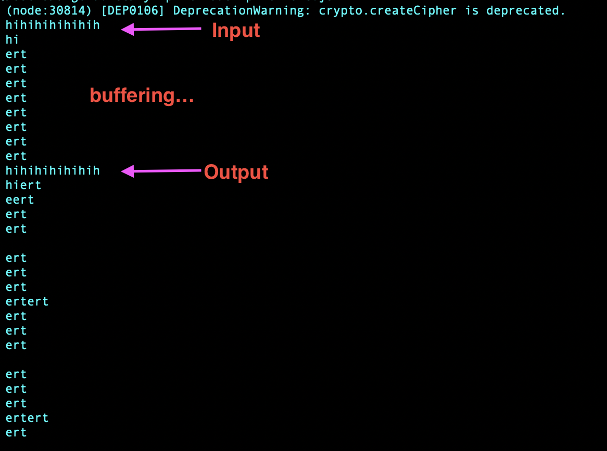

# Simple VPN

A simple VPN sample built with node streams. Example is from samples provided by James Halliday in his Node streams course. Read more here [about streams](https://github.com/substack/stream-handbook/)

## Streams in Node

To understand what this project is trying to express, first let's understand Node and streams.

Imagine what a node server really does: a server is really just a connection point between different computing centers. It's like the main intersection between processes that want to write and retrieve to files, receive and processes continuous networking requests, serve database find results, and so much more. A service can do a multitude of things, from authentication, to uploading video files, but at it's heart it's all about being the point of communication between these. The famous analogy is that of a garden hose, and data is the continuous flow of water from one place to another.

What makes the internet so powerful is that it's always on, like a stream or river it is always ready to respond. It doesn't simply upload and save your document one time in one single execution. Thinking about processes as a stream is a powerful low-level visualization. It's also what makes Node scale. Take for instance, uploading a movie. Due to internet bandwidth limits, you can't simply upload a 2GB video, if it surpasses the traffic limit it will simply get dropped, cancelled, rejected. But by processing that upload in pieces we can meet bandwidth requirements. So instead picture we are uploading 5-min clips of the video instead, in order. 

So when node makes use of streams, it handles the entire request as if it's dealing with exactly that - a long movie broken up into 5-min clips. You'd have a sequence of videos to process, one after the other, until it's finally done uploading and the end event is emitted. Think of it this way, a computer thinks faster than humans, so when you (a human) tries to code and think like a machine, imagine that time is slowed down for them, in order for the human and the machine to communicate. When you're coding a video upload, think about how that looks like in slow motion.

Generalizing to all streams, a video upload is a 'write' action, whereas a download is a 'read' action. All streams are either of these, or even both. When you can both read and write, you have a duplex stream -- like a telephone.

The archetype of all node streams follows this pattern:

```
source.pipe(destination)
```

`pipe` is like the garden hose connecting the source of water to its destination.

You can have some transformation in between:

```
source.pipe(transform).pipe(destination)
```

That is the complete archetype.

## VPN architecture

A VPN is an encrypted proxy. For our example we will set up three processes: 
1. A sample echo server (the website we want to visit),  
2. The VPN (a proxy that goes to the echo server, but is encrypted before and after the request)
3. The Client (the client we use to connect to the VPN, so that in essence, a VPN is both the vpn client and server in combo)

#### Step 1: The Echo server
A duplex uses the node 'archetype' this way:
```
source.pipe(transform).pipe(source)
```

So the source and destination are the same. This will create separate processes, so it won't create an infinite loop. It will however, allow one connection to be both readable and writeable at the same time. We will use this to send text to the connection, and get a response back. It will be the same message we send, hence the echo.

#### Step 2: The VPN Server
Using a crypto module we can encrypt our request with a password, so that it can't be intercepted by anyone without the password. (Only hypothetically, because this encryption is not strong enough to use in real life.) This will be set up exactly the same as the duplex, as a both readable and writable stream, except now we add a layer of transformation, wrapping the start and end of the process with encryption.

#### Step 3: The VPN Client
This simply completes what the VPN server is set up to be. We want console input and output to be captured, then we want to encrypt the input, send it to the VPN server (which will decrypt first). When server sends back the response, it will encrypt, and the client decrypts it before displaying it on the terminal.


## Setup

Start the echo server in a terminal pane.
```
node echo.js
```

In a new pane, start the VPN
```
node vpn.js
```

In a new pane, start the Client
```
node vpn-client.js
```

Now in this last pane, you can start to type anything into the command line, and the message you receive in the terminal should be the same as what you sent.

In order for the encryption to work, it waits for the queue of messages to 'fill up', so you will notice there is no response right away, you may have to send a couple requests before the echo server responds through the VPN.




 
**note: this is for learning purposes only, it is not secure enough to be used as a real VPN**
